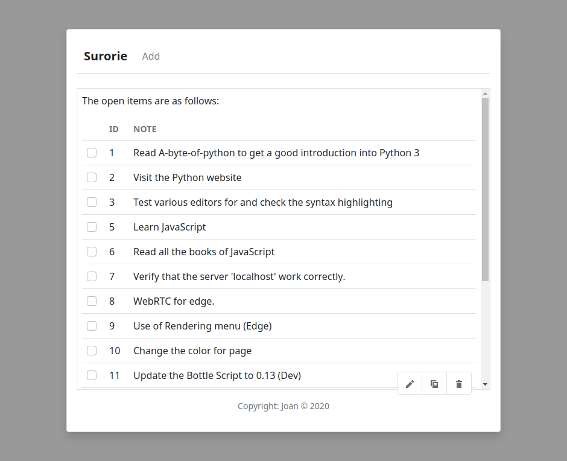
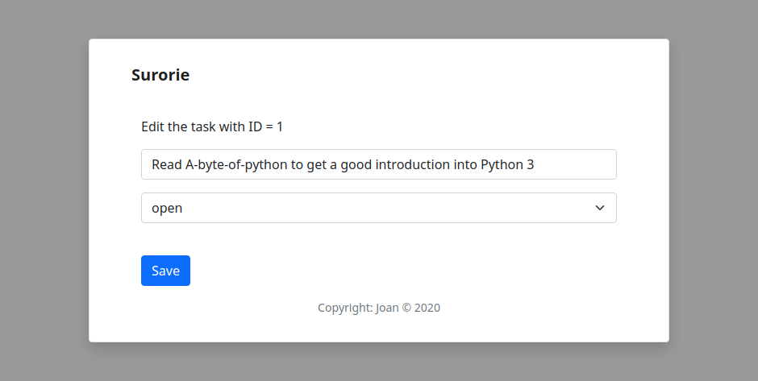
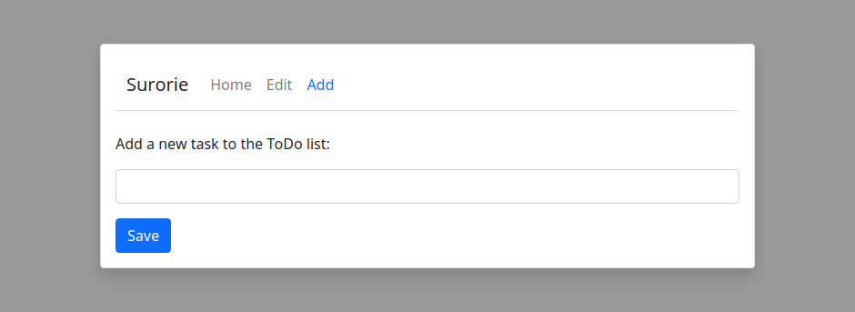

# Surorie

My contribution to ToDo app, universally used for show the benefits of
'x' framework or library, in this case [Bottle](http://bottlepy.org/) 
python.

My reference for this application is taken of 
[here](http://bottlepy.org/docs/0.12/tutorial_app.html) (Bottle - 
Tutorial: Todo-List Application).

### Screenshots 

    
    
    
    

